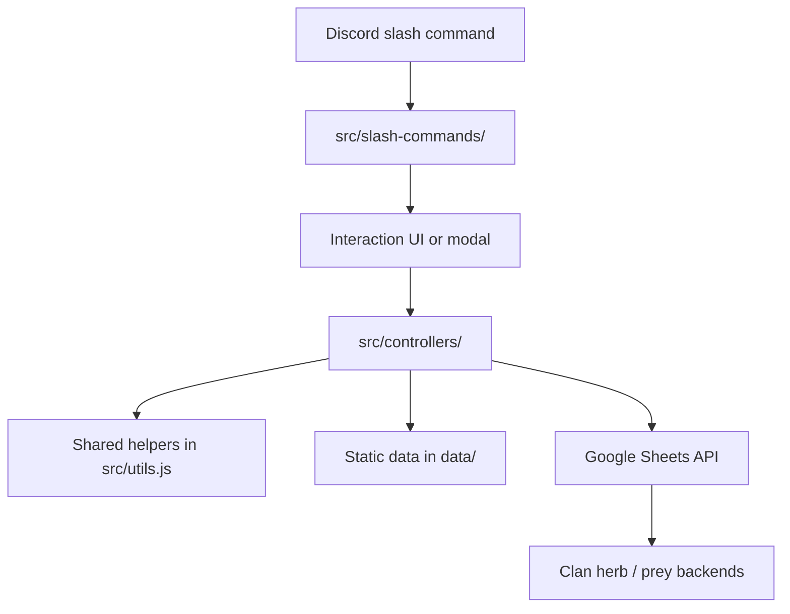

# IggyBotV2

IggyBotV2 is a Discord bot for SOTC, allowing members to do simple tasks without leaving Discord. It provides slash commands for rolling skill checks, viewing clan herb and prey totals, and submitting herb or prey updates into Google Sheets-backed records.

## What The Bot Does

The bot focuses on a small set of repeatable staff actions:

- Roll backup results for common roleplay skills such as hunting, gathering, tracking, sneaking, swimming, climbing, brawling, and healing.
- View the current herb storage for a clan.
- View the current prey count for a clan.
- Search for herb details by clan and herb name.
- Submit herbs to the backend storage sheet.
- Remove herbs from the backend storage sheet.
- Submit prey entries to the backend freshkill sheet.

## How The Project Fits Together

At a high level, the bot follows this workflow:



`src/index.js` starts the Discord client, loads slash commands through `djs-commander`, and logs the bot in with the Discord token. From there, each command file in `src/slash-commands/` handles the user-facing interaction, usually by showing a modal or responding with a formatted result. The command layer then calls into the controller layer in `src/controllers/`, which does the actual work:

- `diceRolling.js` contains the backup roll logic and result tables.
- `herbSearch.js` combines local herb metadata from `data/herbs.json` with live clan sheet data.
- `herbStorage.js` reads the current herb inventory from Google Sheets.
- `preyCount.js` reads the current prey count from Google Sheets.
- `processHerbSubmission.js` appends herb submission rows to the relevant clan backend.
- `processHerbRemoval.js` appends herb removal rows to the relevant clan backend.
- `processPreySubmission.js` validates prey names and categories, then appends prey submission rows to the relevant clan backend.

Shared helpers in `src/utils.js` provide reusable validation, formatting, and capitalization logic. The static JSON files in `data/` hold herb and prey reference data, while the Google service account file in `data/` is used for authenticated Sheets access.

## Command Flow

The command structure is intentionally simple:

1. A user runs a slash command in Discord.
2. The corresponding file in `src/slash-commands/` builds the interaction.
3. If needed, the bot opens a modal or select menu to gather the remaining input.
4. The command hands the submitted values to a controller in `src/controllers/`.
5. The controller validates the data, reads reference files if needed, and talks to Google Sheets.
6. The bot replies in Discord with a formatted result message.

This separation keeps Discord-specific UI code out of the business logic and makes the Sheets logic easier to test.

## Available Commands

The bot currently exposes these user-facing commands:

- `roll20` - Run the backup roll system for hunting, gathering, and other staff-approved skill checks.
- `herb-search` - Look up a herb’s details for a selected clan.
- `herb-storage` - View the current herb inventory for a selected clan.
- `herb-submission` - Submit herbs into the selected clan’s storage backend.
- `herb-removal` - Remove herbs from the selected clan’s storage backend.
- `prey-count` - View the current prey total for a selected clan.
- `prey-submission` - Submit prey into the selected clan’s freshkill backend.

## File Structure

```text
IggyBotV2/
├── data/
│   ├── herbs.json
│   ├── prey.json
│   ├── prey_categories.json
│   └── Google service account JSON used for Sheets access
├── src/
│   ├── controllers/
│   │   ├── diceRolling.js
│   │   ├── herbSearch.js
│   │   ├── herbStorage.js
│   │   ├── preyCount.js
│   │   ├── processHerbRemoval.js
│   │   ├── processHerbSubmission.js
│   │   └── processPreySubmission.js
│   ├── slash-commands/
│   │   ├── diceRollingCommand.js
│   │   ├── herbRemovalModal.js
│   │   ├── herbSearchModal.js
│   │   ├── herbStorageCommand.js
│   │   ├── herbSubmissionModal.js
│   │   ├── preyCountCommand.js
│   │   └── preySubmissionModal.js
│   ├── deleteGlobalCommands.js
│   ├── index.js
│   └── utils.js
├── coverage/
│   └── Jest coverage output
├── package.json
├── package-lock.json
├── readme.md
└── templates.md
```

## Setup

1. Install dependencies.
	```bash
	npm install
	```
2. Create the runtime configuration the bot expects.
3. Make sure the Discord bot and Google Sheets backends are both reachable.
4. Start the bot.
	```bash
	node src/index.js
	```

## Testing

The project uses Jest for unit tests.

```bash
npm test
```

Tests currently cover utility helpers, dice rolling outcomes, herb workflows, and prey workflows.

## Notes

- The bot uses CommonJS modules.
- Command registration is handled at runtime through `djs-commander`.
- Most persistent data lives in Google Sheets, not in local files.
- `deleteGlobalCommands.js` is a maintenance script for clearing registered global Discord commands.

## Contributing

When changing behavior, update the relevant controller and its matching slash-command file together so the UI and business logic stay aligned. If you add a new workflow, document the command, the data source it touches, and the expected result shape in the README so future maintainers and LLM agents can follow the flow quickly.